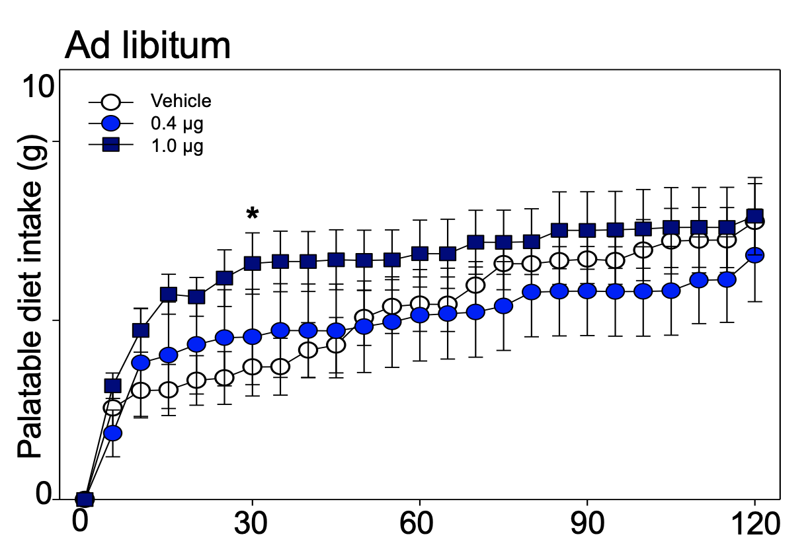

```{r setup, include=FALSE}
knitr::opts_chunk$set(echo = TRUE)
library(tidyverse)
```

My goal in this first portfolio project is to recreate a graph from my first year project poster.
A screenshot of the graph is below:


```{r original-image, echo=FALSE, eval=TRUE}

```

The first thing we need to do is import the data, which I've done below.
The data was originally wide, and I restructured it to long format in SPSS.
Definitely not a long-term solution, but I wanted this project to focus on the graphics (I'll try the restructuring in R for one of my future portfolio projects).

```{r import-data}
library(haven)
data <- read_sav("Long_HWInitialAnalysis.sav")
```

Let's check out what this dataset looks like:

```{r inspect}
head(data)
names(data)
```

This is mostly what we wanted, but I want to create a new variable so that the dose groups aren't indexed just by numbers.
For example, a dose code of 1 indicates the saline treatment, but that isn't obvious at all from the table we have here.
Let's go ahead and make that change:

```{r create-dose-name-variable}
data <- data %>%
  mutate(dosename = case_when(Dose == 1 ~ 'VEH',
                             Dose == 2 ~ 'LO',
                             Dose == 3 ~ 'MED',
                             Dose == 4 ~ 'HI',
                             Dose == 5 ~ 'DAMGO'))
```

It's also a little unclear what the time variable in the existing dataset means.
Cumulative food intake for each animal was measured every five minutes, so we need to multiply the time variable by 5 so that our time variable actually gives us the number of minutes since the feeding session started:

```{r create-time-variable}
data <- data %>%
  mutate(realtime = Time * 5)
```

And now that we've finished wrangling our data we can start graphing.
Let's just give it a very rough first pass to see what happens when I plot intake over time:

```{r first-pass}
ggplot(data = data, mapping = aes(x = realtime,
                                  y = Intake,
                                  color = dosename)) + 
  geom_point() + 
  geom_line()
```

And it's at this point I realized that the points in my original plot are group *means*, and the points in my current data frame are from individual animals.
Just to follow this line of thinking, I'm going to graph the data from each animal separately.
Each plot should have the same general form of the original plot (the plot I want), and that will at least confirm that nothing went horribly wrong in my data processing:

```{r confirmation}
ggplot(data = data, mapping = aes(x = realtime,
                     y = Intake,
                     color = dosename)) + 
  geom_point() + 
  geom_line() +
  facet_wrap(~ rat, ncol = 2)
```

This is good!
The data is set up the way I expected.
Each point does give cumulative intake (since none of the lines go down), and the DAMGO line for each animal ends up being the highest (since DAMGO was our positive control).
This confirms that the next step is to average across animal groups, and calculate standard deviations for the error bars.

Let's give that a shot here. 
I went ahead and restructured the data outside of R (again, to focus on visualization here), so I'll import the new dataset below and filter it so that we only have the rows we want:

```{r import-restructured-data}
means_sds <- read_sav("Descriptives_HWData.sav")
means_sds <- means_sds %>%
  filter(rat == "Average" | rat == "StDev")
```

Next we'll take it through the same processing pipeline we did with our first dataset to create meaningful dose and time variables

```{r processing-take-2}
means_sds <- means_sds %>%
  mutate(dosename = case_when(Dose == 1 ~ 'VEH',
                             Dose == 2 ~ 'LO',
                             Dose == 3 ~ 'MED',
                             Dose == 4 ~ 'HI',
                             Dose == 5 ~ 'DAMGO'))

means_sds <- means_sds %>%
  mutate(realtime = Time * 5)
```

And now we should be ready to try to plot it again:

```{r graph-second-pass}
means_sds %>%
  filter(rat == "Average") %>%
ggplot(mapping = aes(x = realtime,
                     y = Intake,
                     color = dosename)) + 
  geom_point() + 
  geom_line()
```

Perfect!
Still needs a few touches, but this is exactly what we were hoping for.
Next thing to do to recreate the original plot is to filter out some of these groups.
We ended up not displaying the DAMGO and LO groups on the poster, the former because we really only did it as a manipulation check and the latter because it was very similar to the MED group but made the graph difficult to parse visually.
These are filtered out below

```{r graph-with-groups-filtered}
means_sds %>%
  filter(rat == "Average",
         dosename == "VEH" | dosename == "MED" | dosename == "HI") %>%
ggplot(mapping = aes(x = realtime,
                     y = Intake,
                     color = dosename)) + 
  geom_point() + 
  geom_line()
```


